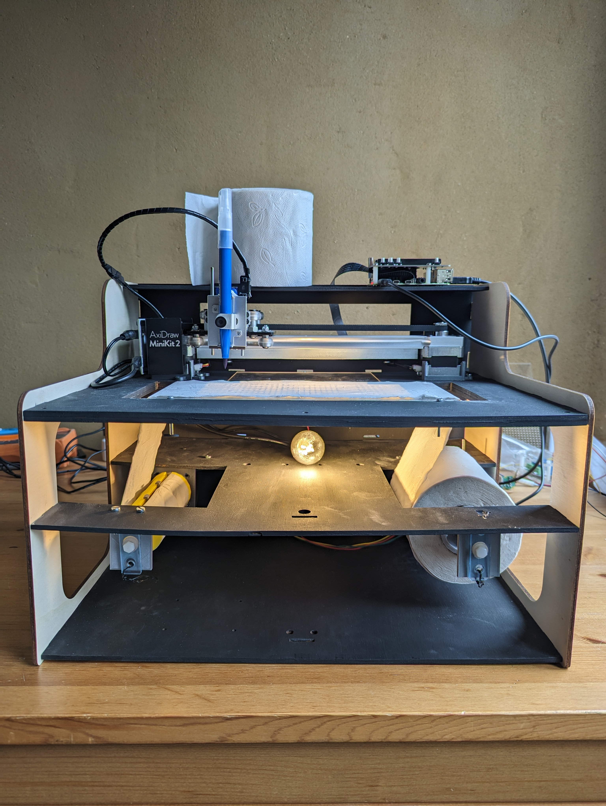

# CoGhentToiletPaper

## Project

	Bringin heritage closer to the people.
An installation interpreting images from [Collectie van de Gentenaar](https://www.collectie.gent/).

The installation places images on a unique timeline, where each image is semantically connected one way or the other.

This timeline is then printed on toilet paper.

_That's about as close as it gets to the people._



## installation


1. Start with a **64-bit** raspberry pi OS as Git lfs needs 64 bits

	tip: enable SSH & setup headless wifi via raspberry pi Imager and CTRL+SHIFT+X

2. Install GIT-lfs:
```bash
wget -c https://github.com/git-lfs/git-lfs/releases/download/v3.2.0/git-lfs-linux-arm64-v3.2.0.tar.gz -O - | tar -xvzf -
cd git-lfs-3.2.0
sudo ./install.sh
```

3. clone the repo with submodules and lfs:
```bash
git clone --recurse-submodules https://github.com/devriesewouter89/CoGhentToiletPaper/
cd CoGhentToiletPaper
git lfs pull
git submodule update --init --recursive
```

4. copy `.env.template` to `.env` and adapt to your needs.
5. install graphviz: `sudo apt install graphviz`
3. install poetry: `curl -sSL https://install.python-poetry.org | python3 -`
4. install all packages: `poetry install`
5. enable the environment: `poetry shell`

[//]: # TODO: adapt [prep_env.sh](./prep_env.sh)

[//]: # ()
[//]: # (**optional:** Want to run docker containers? install docker:)

[//]: # (```bash)

[//]: # (curl -fsSL https://get.docker.com -o get-docker.sh && sudo sh get-docker.sh)

[//]: # (sudo groupadd docker)

[//]: # (sudo usermod -aG docker ${USER})

[//]: # (sudo reboot)

[//]: # (```)

[//]: # ()
[//]: # ()
[//]: # ()
[//]: # ()
[//]: # (### image conversion)

[//]: # ()
[//]: # (multiple approaches:)

[//]: # (1. docker)

[//]: # (2. jupyter notebook)

[//]: # (3. directly via python scripts)

[//]: # ()
[//]: # ()
[//]: # (#### docker )

[//]: # ()
[//]: # (if CUDA cores available:)

[//]: # (```bash)

[//]: # (docker build -f Dockerfile.GPU -t imageconversion .)

[//]: # (```)

[//]: # ()
[//]: # (else )

[//]: # ()
[//]: # (```bash)

[//]: # (docker build -f Dockerfile.CPU -t imageconversion .)

[//]: # (```)

[//]: # ()
[//]: # (to run with the example folders: )

[//]: # (```bash)

[//]: # (docker run --name imgconv --mount type=bind,source="$&#40;pwd&#41;"/input,target=/coghent_input --mount type=bind,source="$&#40;pwd&#41;"/output/lineart,target=/workspace/coghent_vectors --mount type=bind,source="$&#40;pwd&#41;"/output/vectors,target=/workspace/coghent_lineart imageconversion)

[//]: # ()
[//]: # (```)

[//]: # ()
[//]: # (and then to start it:)

[//]: # (```bash)

[//]: # (docker start -a imgconv)

[//]: # (```)

## Nice to haves

### a web ui

perhaps in flutter? to check the state of the statemachine
