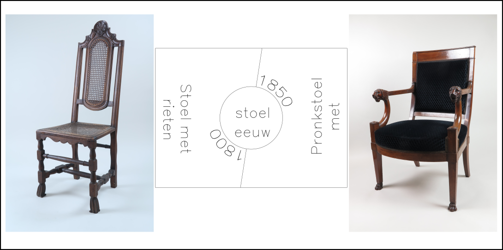
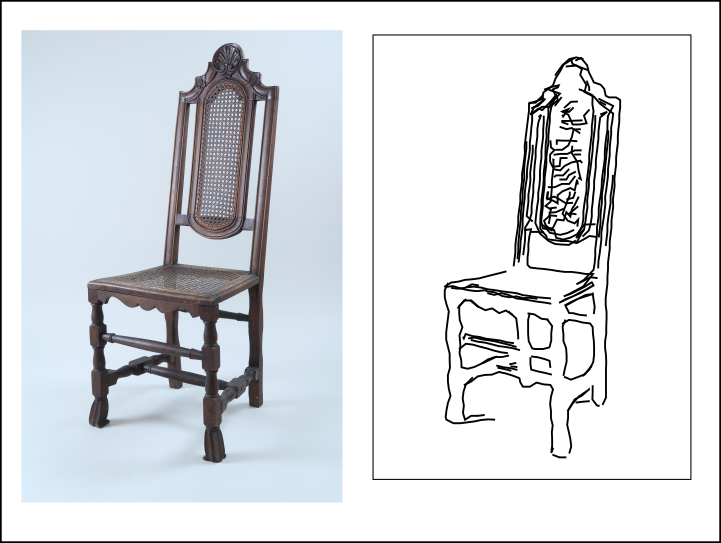
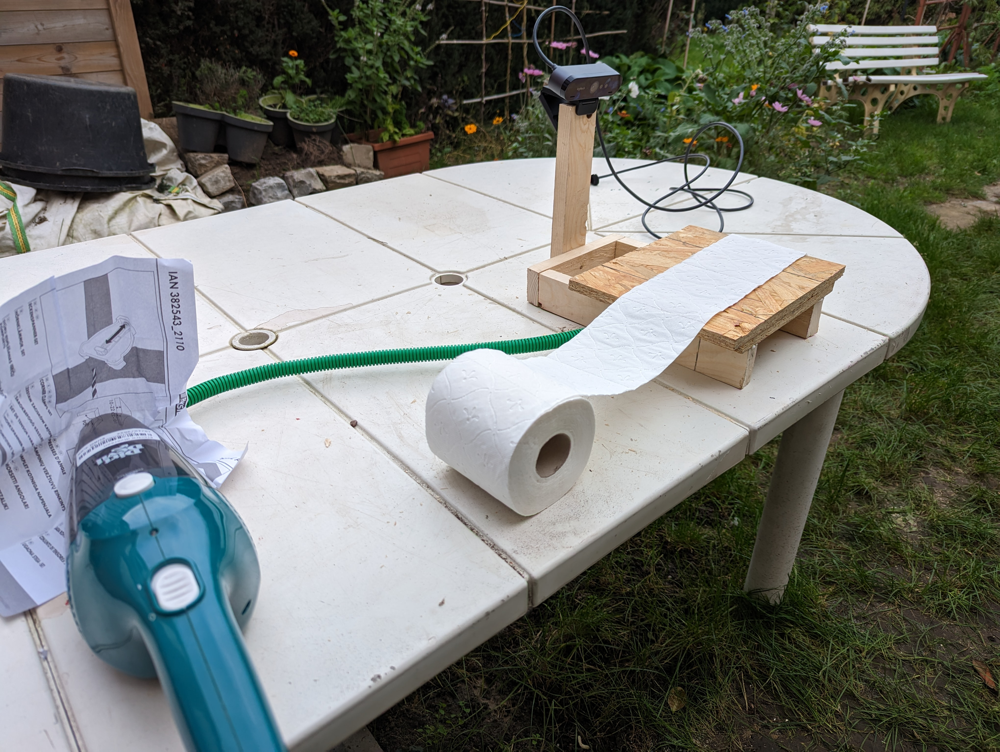
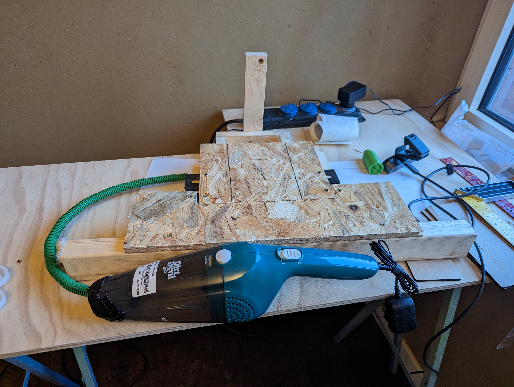
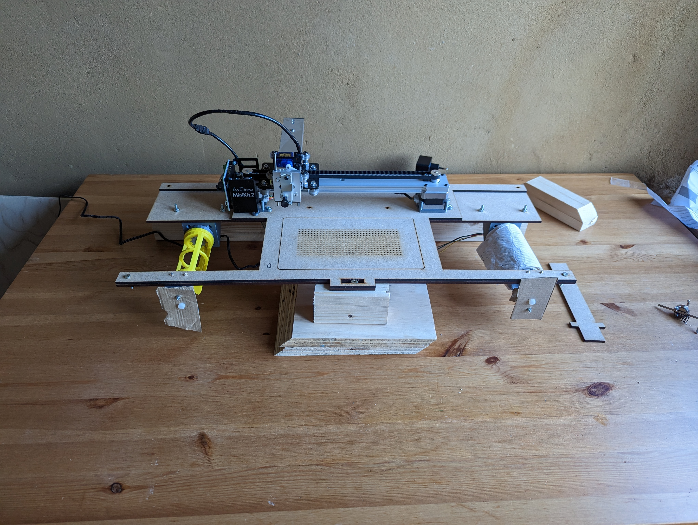
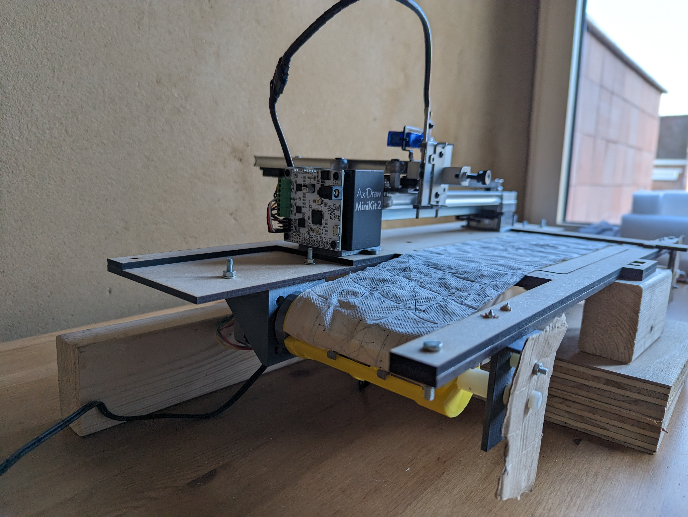
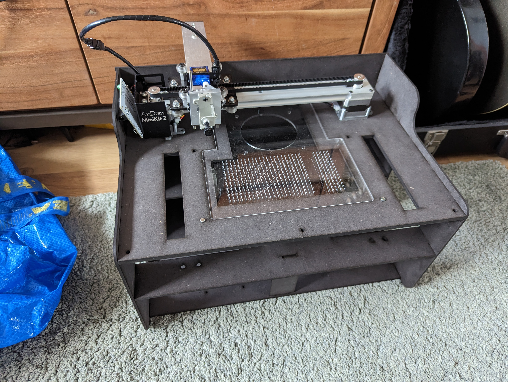
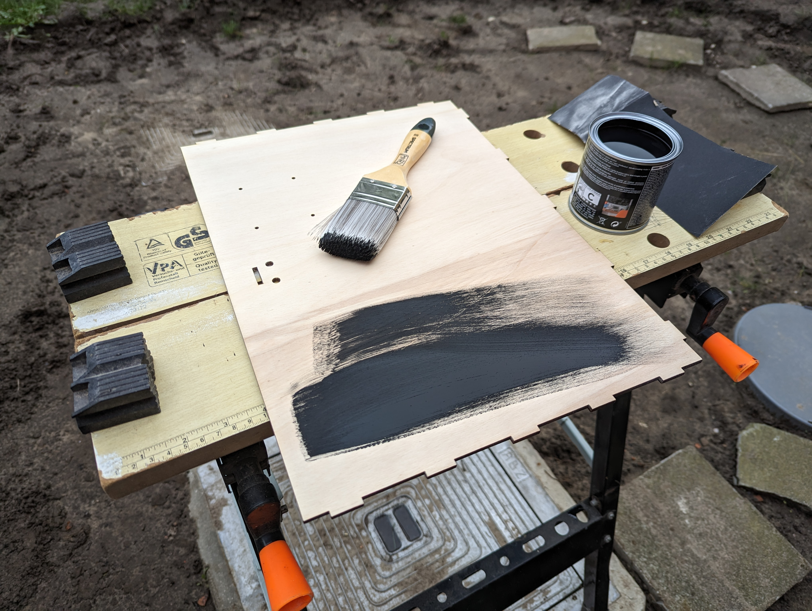
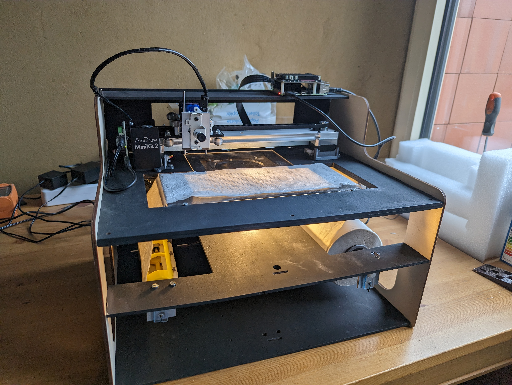
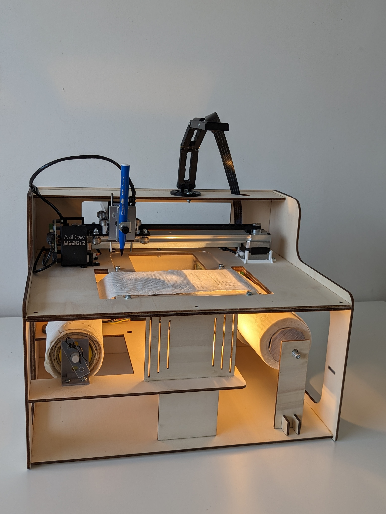

# De Gentse rol van het WC

Wouter Devriese

---
transition: fade-out
---

# Oorsprong

1. collectie - LDES:
    1. weerspiegeling fysieke collectie
    2. semantisch verrijkt
    3. definitieve inhoud? (updates - toevoegingen)

<v-click>

2. hoe kan men naar de collectie kijken?
    1. minder gecureerd
    2. individu kiest zelf pad doorheen de collectie
    3. persoonlijk: muziek leren kennen
        1. voor gekauwde playlists 
        2. zelf verbanden zoeken

</v-click>

<!--
het punt van de collectie is dat het dus op een LDES stream staat, wat ik daar persoonlijk uit interessant vond was het punt dat het naast de weerspiegeling van de fysieke collecties, ook semantisch verrijkt is, en dat objecten updates kunnen krijgen, of dat objecten toegevoegd worden. De collectie krijgt zo een dynamisch kantje

-->

---
layout: default
transition: fade-out

---

# Brainstorm 

Algemene vragen:

- tijdslijn?
- fysiek aandenken?
- collectie tot bij burger?

...

---
layout: image-right
image: https://i.guim.co.uk/img/media/e1492f95308c7f3b1c1e13ba51f57e02fd4021c5/0_236_7087_4254/master/7087.jpg?width=1200&quality=85&auto=format&fit=max&s=5a8bcb2a58b1b1bff28a096076449ad9
---

# Brainstorm 

Algemene vragen:

- tijdslijn?
- fysiek aandenken?
- collectie tot bij burger?

...

WC-papier 

---
layout: image-right
image: ./images/prototype_2.jpg
---

# Installatie

- die telkens nieuwe paden doorheen de collectie zoekt
- deze print op een WC-rol
- zo unieke wc-rollen creerend

---
layout: 3-images
imageLeft: ./images/process/tree.png
imageTopRight: ./images/process/in_between.svg
imageBottomRight: './images/process/0.jpg'
---
---
layout: image-right
image: ./images/process/0.jpg
---

# download image

---
layout: image-right
image: ./images/process/lineart.png
layout: image-left
image: ./images/process/tree.png
---

# pad

"Deze **stoel** heeft een hoge rechte rugleuning die wordt benadrukt door het snijwerk van de kapregel. 
De rechte achterpoten van de **stoel** lopen zonder onderbreking over in de stijlen van de rugleuning. 
Deze **stoel** werd geconstrueerd in de 19de eeuw met <u>vermoedelijk</u> <...>"

"Deze pronkzetel met vernieuwde <...> 
Achteraan steunt de **stoel** op sabelpoten ('à l'étrusque'). <...> werd hij <u>vermoedelijk</u> uitgevoerd in het midden van de 19de eeuw. 
Vergelijkbare **stoel**en zijn te vinden in de collecties van het Bayerisches Nationalmuseum in München en Musée des Arts Décoratifs in Parijs."

*'stoel', 'eeuw', 'vermoedelijk', '19de'*

---
layout: default

---

---

# convert to lineart
---
layout: image-right
image: ./images/process/0.svg
---

# convert to lineart
layout: default
image: 
---

# conversion

<!--

---
layout: image-right
image: ./images/coghent_fest.MP4
---

# Doel

*Erfgoed dichter bij de burger brengen*

nut van

<v-clicks>

- WC-rol als functioneel object 
    - niet noemenswaardig
- WC-rol als esthethisch object 
    - niet noemenswaardig
- WC rol & installatie als conversation starter

</v-clicks>
 -->
---
layout: image-right
image: ./images/fusion.jpg
---

# bouwen

<v-click>

- LDES als nieuwe technologie
- code
- mechanisch ontwerp:
    - fast prototyping (zaag + vijs + ducttape)
    - 3D print
    - lasercut
- open-source reproduceerbaar 
- WC-papier als medium = horror
</v-click>

---
layout: 3-images
imageLeft: images/paper/lots.jpg
imageTopRight: images/paper/notches.png
imageBottomRight: images/paper/too_much_ink.jpg
---

---
layout: default
transition: fade-out
---

# evolutie

---
layout: default
transition: fade-out

---

# evolutie

---
layout: default
transition: fade-out

---

# evolutie

---
layout: default
transition: fade-out

---

# evolutie

---
layout: default
transition: fade-out

---

# evolutie  

---
layout: default
transition: fade-out

---

# evolutie

---
layout: default
transition: fade-out

---

# evolutie

---
layout: default
transition: fade-out

---

# evolutie

---
layout: default
transition: fade-out
---

# evolutie

---
layout: center
transition: fade-out
---

# "Final"

