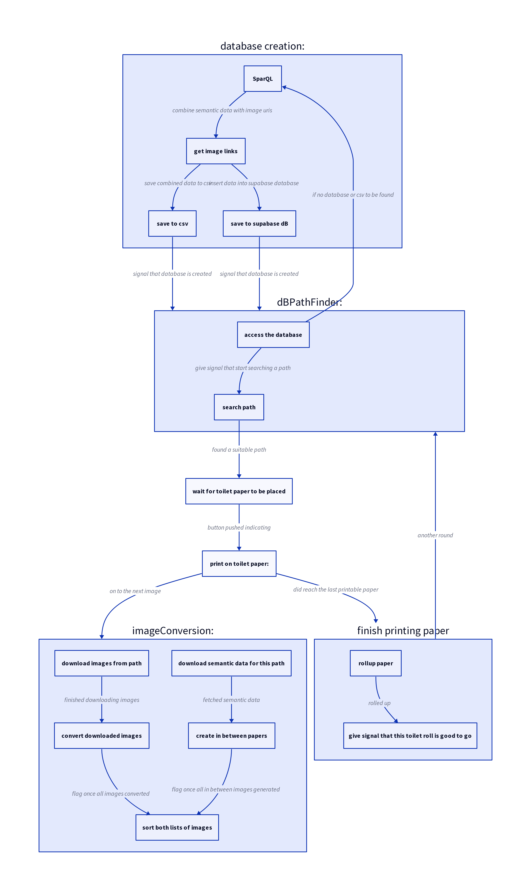

---
# Feel free to add content and custom Front Matter to this file.
# To modify the layout, see https://jekyllrb.com/docs/themes/#overriding-theme-defaults

layout: page
title: "Installation Overview"
---

# Process

1. [getting the data and preparing it](#getting-the-data-and-preparing-it)
2. [insert paper roll](#insert-paper-roll)
3. [paper gets sucked down with the fan](#paper-gets-sucked-down-with-the-fan)
4. [two steppers to roll off the paper](#two-steppers-to-roll-off-the-paper)
5. [when to stop rolling? Camera + notches + light to the rescue](#when-to-stop-rolling)
6. [drawing via axidraw mini](#drawing-via-axidraw-mini)
7. [drawing with markers on toilet paper: the good, the bad & a lot of uglyness](#drawing--markers--toilet-paper)
8. [the physical setup: lasercut + 3D print](#the-physical-setup)

## Getting the data and preparing it

- initial plan: Nvidia Jetson, yet shortage, had an RPi 4 around.

## insert paper roll

## paper gets sucked down with the fan

## two steppers to roll off the paper

- notice: had to sand of all hard corners & align the height of all different parts, so the corner the paper took was not too steep. otherwise the paper would get torn apart.

## When to stop rolling?

## Drawing via Axidraw Mini

## drawing + markers +  toilet paper

- fonts: single line fonts necessary
- ink flows: need to take into account not using small text
- markers: need soft tips (not tearing the paper) + 

## the physical setup

